# Molecular Simulation

This repository contains a computational physics project focused on stochastic dynamics and molecular simulation.

The project is divided into two independent modules:

- `stochastic-1d`: 1D Langevin dynamics for simple stochastic systems.
- `polymer-dynamics`: molecular dynamics simulation of polymer chains.

The first module studies simple one-dimensional systems such as the harmonic oscillator and the double-well potential. The second module extends the same physical ideas to a polymer chain model, including elastic bonds, thermal noise, structural observables, and additional molecular interactions.

---

## Repository Structure

```text
molecular-simulation/
├── stochastic-1d/
│   ├── include/
│   ├── src/
│   ├── results/
│   └── Makefile
│
├── polymer-dynamics/
│   ├── include/
│   ├── src/
│   ├── results/
│   └── Makefile
│
├── figures/
│   ├── stochastic_methods.png
│   ├── random_gaussian_noise.png
│   ├── harmonic_oscillator_energy.png
│   ├── double_well_trajectory.png
│   ├── double_well_distribution.png
│   ├── double_well_external_force.png
│   ├── polymer_bead_spring_model.png
│   ├── polymer_radius_gyration_definition.png
│   ├── polymer_radius_gyration_simulation.png
│   ├── polymer_parameter_sweep.png
│   ├── polymer_force_extension.png
│   └── polymer_extended_model.png
│
└── README.md
```

---

# Part I: Stochastic 1D Dynamics

The `stochastic-1d` module studies the dynamics of a particle in one dimension under the effect of deterministic forces, viscous friction, and thermal stochastic noise.

The main goal is to simulate Langevin dynamics and analyze how numerical integration methods reproduce expected statistical and thermodynamic behavior.

---

## Physical Model

The motion is modeled using a Langevin-type equation. The particle is affected by:

- A deterministic force derived from a potential.
- A friction term proportional to velocity.
- A random Gaussian force representing thermal fluctuations.

In simplified form:

```text
m d2x/dt2 = F(x) - eta dx/dt + xi(t)
```

where:

- `m` is the mass.
- `F(x)` is the deterministic force.
- `eta` is the friction coefficient.
- `xi(t)` is the stochastic thermal force.

The thermal noise is controlled by the temperature through `kBT`.

---

## Numerical Integration Methods

Several stochastic integration methods are implemented and compared:

- Stochastic Euler
- Stochastic Verlet
- Second-order Runge-Kutta

These methods are used to integrate Langevin dynamics under different potentials and friction regimes.

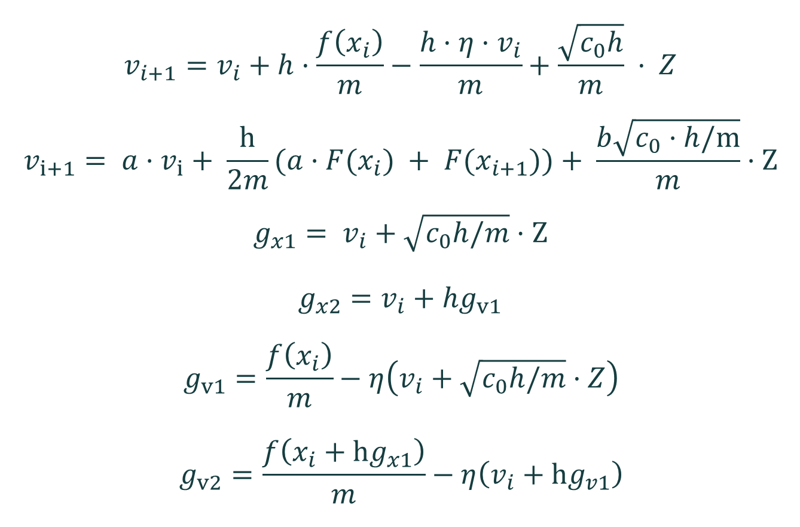

The comparison between methods is important because stochastic systems can be sensitive to timestep size, friction, and noise amplitude.

---

## Random Number Generation

Thermal noise is generated from Gaussian random variables. The project uses the Box-Muller transform to convert uniformly distributed random numbers into normally distributed variables.

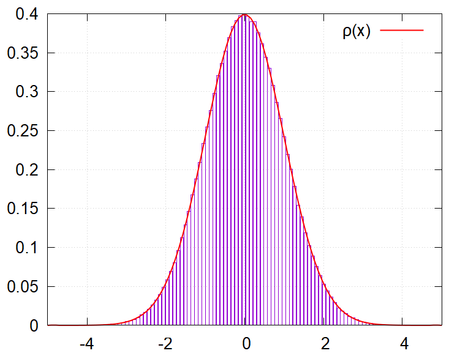

The stochastic force is essential for reproducing thermal equilibrium and allowing transitions between metastable states in systems such as the double-well potential.

---

## Harmonic Oscillator

The harmonic oscillator is used as the first validation system.

The potential is:

```text
V(x) = 1/2 k x^2
```

This system is useful because its equilibrium behavior is well known. The simulation checks whether the numerical methods recover the expected equipartition of energy.

Main checks:

- Kinetic energy approaches the expected thermal value.
- Potential energy approaches the expected thermal value.
- Total energy stabilizes statistically over long simulations.
- The position and velocity distributions are compatible with theoretical predictions.

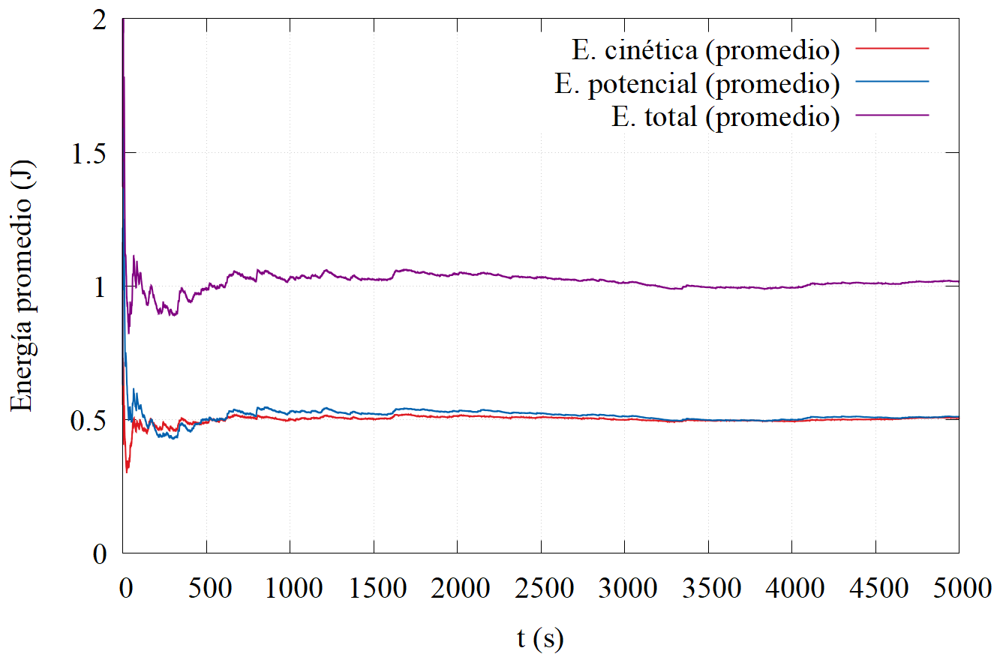

This validation step is important before moving to more complex potentials.

---

## Double-Well Potential

The second system is a particle in a double-well potential.

The potential has two stable minima separated by an energy barrier:

```text
V(x) = A (x^2 - 1)^2
```

This system is useful for studying thermally activated transitions. Noise allows the particle to jump from one well to the other.

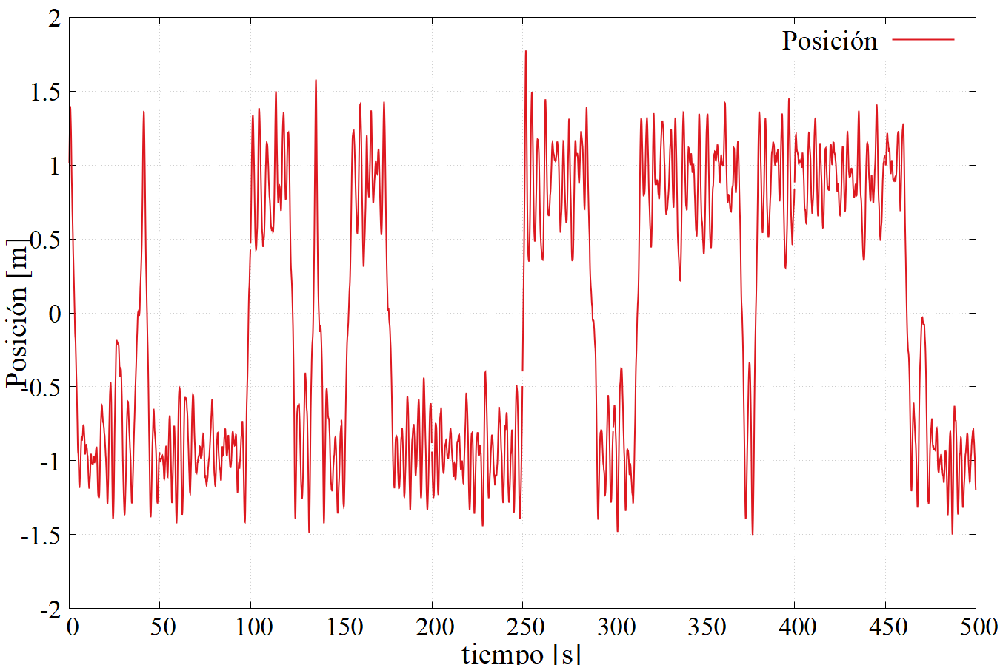

Main quantities analyzed:

- Particle trajectory.
- Position distribution.
- Velocity distribution.
- Residence times in each well.
- Number of transitions between wells.
- Occupation probability of each well.

---

## Double-Well Position Distribution

The particle distribution depends strongly on temperature, friction, and barrier height.

At low temperature, the particle tends to remain trapped in one well for longer times. At higher temperature, transitions become more frequent.

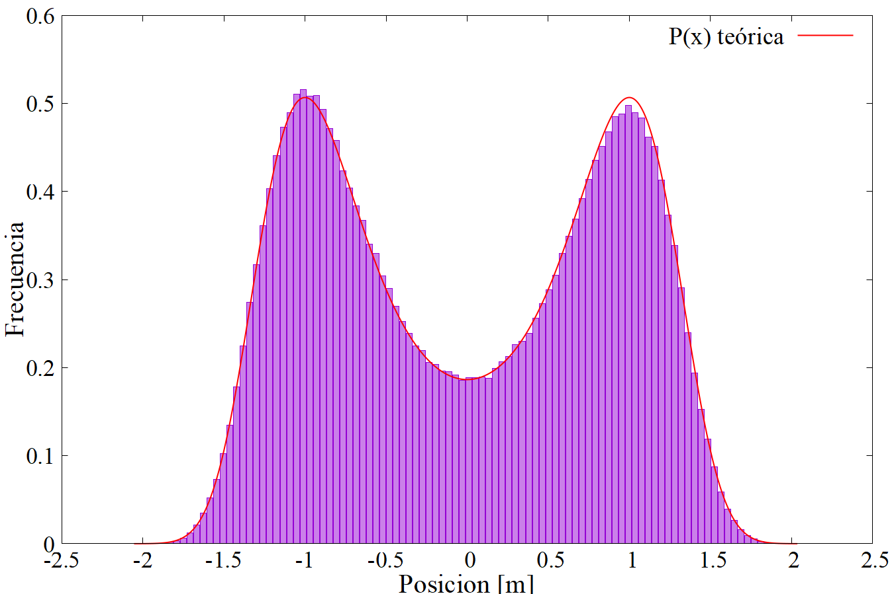

This allows the simulation to capture the relationship between thermal noise and barrier crossing.

---

## Residence Times and Well Occupation

For the symmetric double-well system, both wells should be occupied equally in the long-time limit.

The simulation measures:

```text
T_right
T_left
Number of transitions
```

These observables provide a statistical description of the switching process.

The residence time distribution is especially relevant because it characterizes how long the system remains in one metastable state before crossing the barrier.

---

## External Force in the Double-Well Potential

The model is extended by adding a constant external force:

```text
V(x) = A (x^2 - 1)^2 - F x
```

This breaks the symmetry between the two wells.

Consequences:

- One well becomes energetically favored.
- The occupation probability becomes biased.
- The probability of finding the particle at `x > 0` depends on the external force.

For small forces, the occupation probability can be approximated by a sigmoid-like expression.

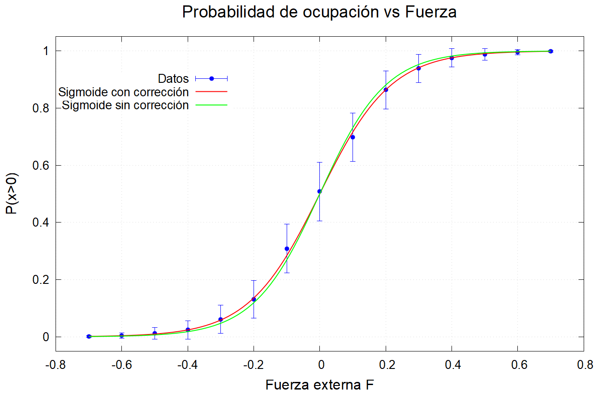

This part connects stochastic simulation with equilibrium statistical mechanics.

---

## Summary of the Stochastic 1D Module

The `stochastic-1d` module demonstrates:

- Numerical integration of Langevin dynamics.
- Generation of thermal Gaussian noise.
- Validation through the harmonic oscillator.
- Barrier-crossing dynamics in a double-well potential.
- Statistical analysis of residence times and well occupation.
- Effect of a constant external force on equilibrium probabilities.

This module provides the foundation for the polymer molecular dynamics simulations.

---

# Part II: Polymer Dynamics

The `polymer-dynamics` module extends the simulation framework to a bead-spring polymer model.

The polymer is represented as a chain of particles connected by elastic bonds and evolving under molecular dynamics with thermal fluctuations.

---

## Polymer Model

The polymer is modeled as a chain of particles with neighboring particles connected by harmonic springs.

The bond potential is:

```text
V(r_i, r_i+1) = 1/2 k (|r_i - r_i+1| - b)^2
```

where:

- `k` is the bond stiffness.
- `b` is the equilibrium bond length.
- `r_i` is the position of particle `i`.

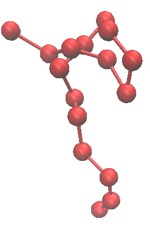

This model is inspired by the freely jointed chain framework, but uses elastic bonds instead of perfectly rigid segments.

---

## Thermodynamic Validation

The simulation checks whether the polymer model reaches a physically consistent thermal state.

The main validation criterion is energy equipartition.

The code analyzes:

- Mean kinetic energy.
- Mean potential energy.
- Stability of the total energy.
- Dependence on simulation parameters.

In the reference simulations, kinetic and potential contributions fluctuate around their expected equilibrium values.

This step ensures that the polymer model is numerically stable before analyzing structural observables.

---

## Radius of Gyration

The radius of gyration measures the spatial size of the polymer chain.

It is defined as the mean squared distance of the particles from the center of mass:

```text
Rg^2 = (1/N) sum_i |R_i - R_CM|^2
```

where:

- `N` is the number of particles.
- `R_i` is the position of particle `i`.
- `R_CM` is the center of mass.

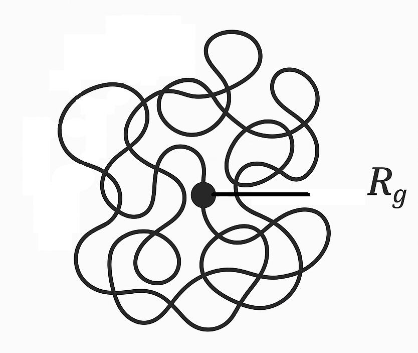

The radius of gyration is one of the most important observables in polymer physics because it quantifies the extension of the chain in space.

---

## Analytical Scaling

For an ideal polymer chain, the radius of gyration is expected to scale with the number of segments.

In the rigid-bond limit, the expected behavior is approximately:

```text
Rg^2 ~ b^2 (N - 1/N) / 6
```

The simulation compares numerical results with this theoretical prediction.

This makes the polymer module more than a visualization tool: it directly tests statistical physics predictions.

---

## Radius of Gyration Simulation

The simulation studies the behavior of `Rg^2` for fixed bond parameters.

Typical parameters include:

```text
kBT = 1.0
b = 1.0
k = 10.0 or 100.0
dt = 1e-2
```

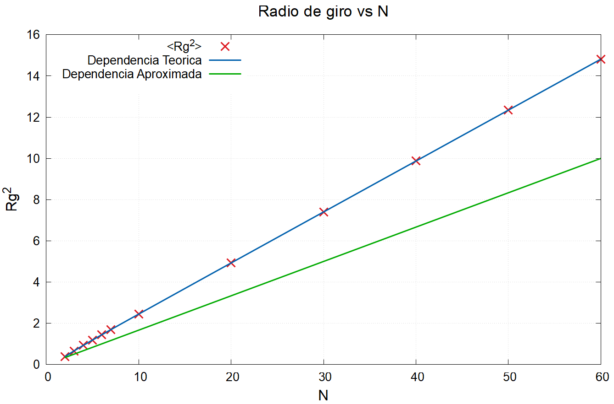

The results show the expected dependence of chain size on the number of particles and bond properties.

---

## Parameter Dependence

The project also studies how the polymer size changes when varying model parameters.

The main sweeps are:

- Bond stiffness `k`
- Equilibrium bond length `b`
- Number of particles `N`

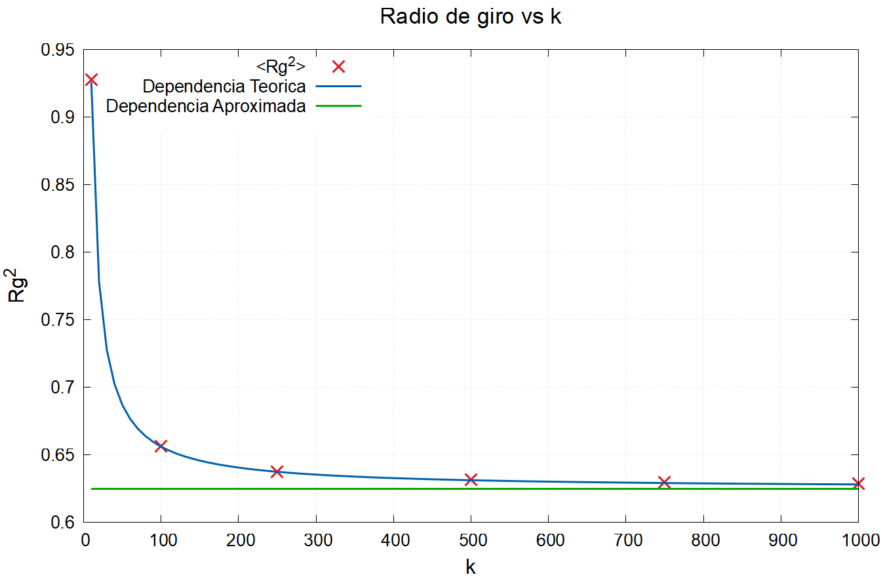

These sweeps help verify how microscopic model parameters affect macroscopic chain observables.

---

## Force-Extension Behavior

The polymer is also studied under an external pulling force.

The goal is to compare the simulated end-to-end extension with the theoretical Langevin force-extension relation.

For a freely jointed chain, the extension is related to the Langevin function:

```text
L(F) / L_nat = coth(Fb / kBT) - kBT / (Fb)
```

For elastic bonds, an additional correction appears due to bond stretching.

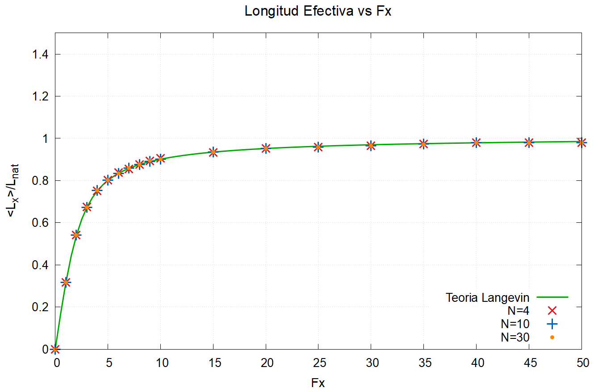

This allows comparison between:

- Rigid polymer behavior.
- Elastic polymer behavior.
- Theoretical force-extension predictions.

---

# Extended Polymer Model

The polymer model is extended by adding more realistic molecular interactions.

These interactions include:

- Lennard-Jones interactions.
- Electrostatic interactions.
- Bending energy.

---

## Lennard-Jones Interactions

The Lennard-Jones potential models short-range repulsion and longer-range attraction:

```text
V_LJ(r) = 4 epsilon [ (sigma/r)^12 - (sigma/r)^6 ]
```

where:

- `sigma` controls the characteristic interaction distance.
- `epsilon` controls the energy scale.

This interaction is useful for representing excluded volume effects and attractive interactions between non-bonded particles.

A cutoff radius `rc` is also introduced to reduce computational cost and control the interaction range.

---

## Electrostatic Interactions

Electrostatic interactions are included by assigning charges to particles.

The model allows charged monomers to interact through Coulomb-like forces.

This is useful for representing simplified pH-dependent charge effects in polymer or protein-like chains.

---

## Bending Energy

The bending energy introduces stiffness into the polymer chain.

It depends on the angle between consecutive bonds:

```text
V_b(theta) = k_b [1 - cos(theta - theta_0)]
```

where:

- `k_b` controls bending stiffness.
- `theta_0` is the preferred angle.

This interaction involves three consecutive particles and controls the persistence length of the chain.

Higher bending stiffness produces more rigid polymer conformations.

---

## Combined Extended Model

The extended model combines:

- Elastic bonds.
- Lennard-Jones interactions.
- Electrostatic interactions.
- Bending forces.

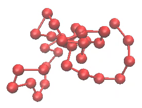

This produces more realistic polymer behavior and allows comparison between the base bead-spring model and a more physically rich molecular model.

---

# How to Run

Each module can be compiled independently.

## Stochastic 1D

```bash
cd stochastic-1d
make
./simulation
```

## Polymer Dynamics

```bash
cd polymer-dynamics
make
./simulation
```

Some plotting features may require `gnuplot`.

---

# Requirements

The project is written in C.

Recommended tools:

```text
gcc
make
gnuplot
```

Optional visualization tools:

```text
VMD
```

---

# Main Concepts

This repository covers:

- Langevin dynamics.
- Stochastic differential equations.
- Gaussian thermal noise.
- Numerical integration schemes.
- Harmonic oscillator validation.
- Double-well barrier crossing.
- Residence time statistics.
- Polymer bead-spring models.
- Radius of gyration.
- Force-extension behavior.
- Lennard-Jones interactions.
- Electrostatic interactions.
- Bending energy.

---

# Notes

This project is intended as a computational physics and molecular simulation study.

The code is designed to explore physical behavior rather than provide a production molecular dynamics engine.

The structure separates simple stochastic models from polymer simulations so that each part can be studied and extended independently.

---

# Figure List

The README expects the following files inside the `figures/` folder:

```text
figures/
├── stochastic_methods.png
├── random_gaussian_noise.png
├── harmonic_oscillator_energy.png
├── double_well_trajectory.png
├── double_well_distribution.png
├── double_well_external_force.png
├── polymer_bead_spring_model.png
├── polymer_radius_gyration_definition.png
├── polymer_radius_gyration_simulation.png
├── polymer_parameter_sweep.png
├── polymer_force_extension.png
└── polymer_extended_model.png
```
